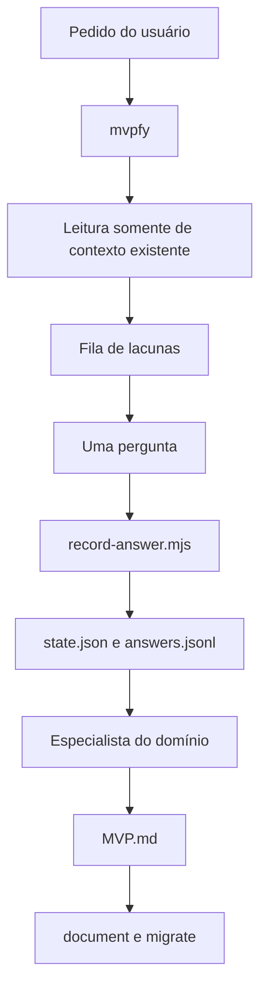

# Arquitetura do MVPFy

O MVPFy é uma biblioteca de skills instalada em um projeto consumidor. A
orquestradora conversa com a pessoa, as especialistas analisam domínios e os
scripts cuidam de operações determinísticas.

## Fluxo de dados

## Responsabilidades

| Parte | Responsabilidade |
| --- | --- |
| `mvpfy` | Intenção, leitura de contexto, fila, pergunta única e handoff. |
| Especialistas | Conhecimento e saída estruturada de cada domínio. |
| `mvpfy-document` | Renderização e validação do documento. |
| `mvpfy-migrate` | Evolução do template sem perda. |
| Scripts | Persistência, transformação e validação repetíveis. |
| Testes | Garantia de catálogo, scripts e documento. |

## Uma pergunta por turno

Esse é um contrato de interface, não uma preferência de redação. A
orquestradora pode usar várias fontes internas para decidir a próxima ação,
mas a mensagem ao usuário contém somente uma pergunta principal. As opções
numeradas respondem a essa mesma pergunta.

Antes de enviar, a skill confere se não está solicitando duas informações, se
não repetiu algo presente em uma spec ou backlog e se a gravação do turno
anterior ocorreu.

## Fontes somente para leitura

No projeto consumidor, a orquestradora pode ler `spec.md`, `specs/`,
`backlog/`, `docs/`, briefs, tickets e planos existentes. Essa leitura reduz a
quantidade de perguntas. Nenhum desses arquivos é uma saída do MVPFy e nenhum
é criado ou alterado por suas skills.

## Fora da arquitetura

O MVPFy não implementa software SaaS, não executa código de produção e não
altera o repositório Specsfy. O escopo de escrita é `MVP.md`, `.mvpfy/` e,
quando a pessoa pedir, os artefatos de documentação do próprio pacote.
